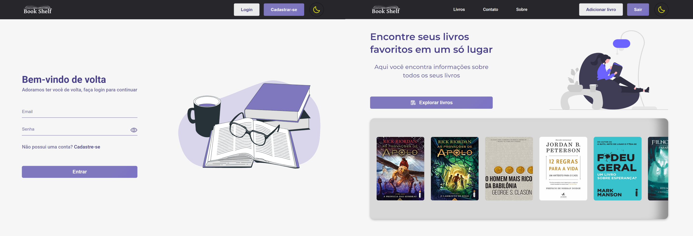
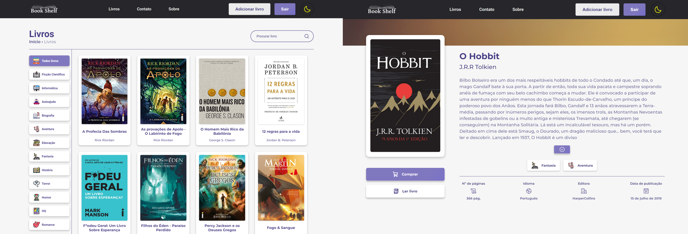

<h1 align="center"> Book Shelf </h1>

Projeto criado para praticar a aprimorar minhas habilidades com React.

  <a href="#-tecnologias">Tecnologias</a>&nbsp;&nbsp;&nbsp;|&nbsp;&nbsp;&nbsp;
  <a href="#-projeto">Projeto</a>&nbsp;&nbsp;&nbsp;|&nbsp;&nbsp;&nbsp;
  <a href="#-layout">Layout</a>&nbsp;&nbsp;&nbsp;|&nbsp;&nbsp;&nbsp;
  <a href="#memo-licença">Licença</a>

  

 

  
  

## 🚀 Tecnologias

Esse projeto foi desenvolvido com as seguintes tecnologias:

- [React](https://reactjs.org/)
- [Firebase](https://firebase.google.com/)
- [Framer Motion](https://www.framer.com/motion/)
- [Node e NPM](https://nodejs.org/)
- [Sass](https://sass-lang.com/)
- [Vite](https://vitejs.dev/)

## 💻 Projeto

O Book Shelf é um site onde o usuário pode descobrir novos livros, comprar e lê-los online, além de descobrir informações sobre os seus livros favoritos.

## 🔖 Layout

Você pode visualizar o layout do projeto através [DESSE LINK](https://www.figma.com/file/PBNtehjrtcUhPvXpUBgwGT/Estudando-React?t=f2Iz5bJ5KgA7ROkA-1). É necessário ter conta no [Figma](https://figma.com) para acessá-lo.

## :memo: Licença

Esse projeto está sob a licença MIT.